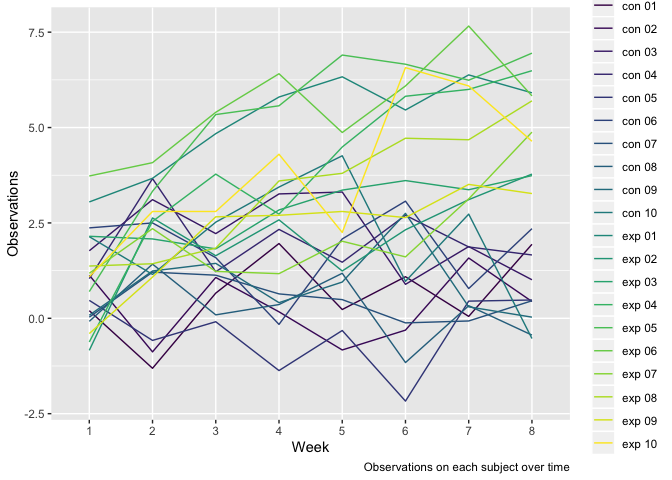
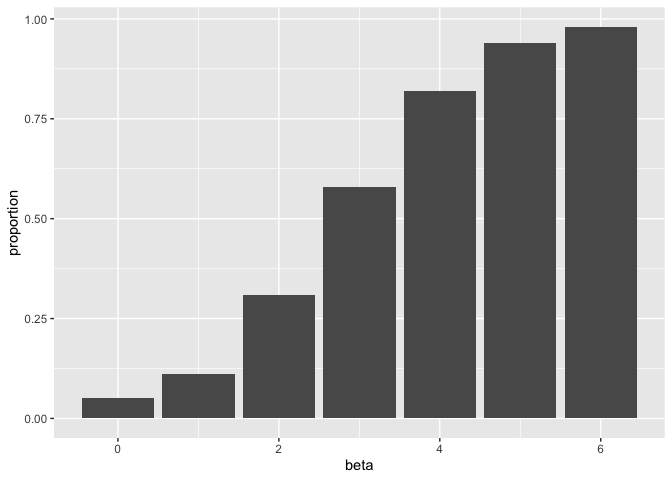
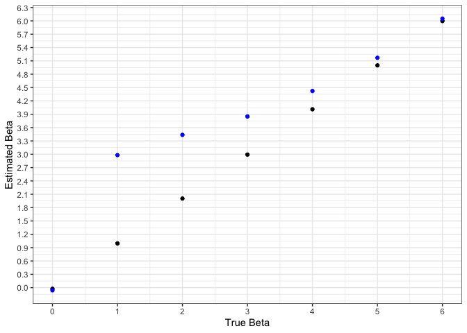

p8105\_hw5\_zc2443
================
Ziyang Chen
11-3-2019

# Problem 1

``` r
set.seed(10)

iris_with_missing = iris %>% 
  map_df(~replace(.x, sample(1:150, 20), NA)) %>%
  mutate(Species = as.character(Species))

replace_missing = function(vec) {
  if (is.numeric(vec)) {
    vec = replace(vec, is.na(vec), round(mean(vec, na.rm = TRUE), digits = 1))
    #vec(is.na(vec)) = mean(vec, na.rm = TRUE)
  }
  else if (is.character(vec)) {
    vec = replace(vec, is.na(vec), "virginica")
    #vec(is.na(vec)) = "virginica"
  }
  vec
}

map(iris_with_missing, replace_missing)
```

    ## $Sepal.Length
    ##   [1] 5.1 4.9 4.7 4.6 5.0 5.4 5.8 5.0 4.4 4.9 5.4 4.8 5.8 4.3 5.8 5.7 5.4
    ##  [18] 5.1 5.7 5.1 5.4 5.1 4.6 5.8 4.8 5.0 5.0 5.2 5.8 4.7 4.8 5.4 5.2 5.5
    ##  [35] 4.9 5.0 5.5 4.9 4.4 5.1 5.0 4.5 4.4 5.0 5.1 4.8 5.1 4.6 5.3 5.0 7.0
    ##  [52] 6.4 6.9 5.5 6.5 5.7 6.3 4.9 6.6 5.2 5.0 5.9 6.0 6.1 5.6 6.7 5.6 5.8
    ##  [69] 6.2 5.6 5.9 5.8 6.3 5.8 6.4 6.6 6.8 6.7 6.0 5.7 5.5 5.8 5.8 6.0 5.4
    ##  [86] 5.8 6.7 5.8 5.6 5.5 5.5 5.8 5.8 5.0 5.8 5.7 5.7 6.2 5.1 5.7 6.3 5.8
    ## [103] 7.1 6.3 6.5 7.6 4.9 7.3 6.7 5.8 6.5 5.8 6.8 5.7 5.8 6.4 6.5 7.7 7.7
    ## [120] 6.0 5.8 5.6 7.7 6.3 6.7 7.2 6.2 6.1 6.4 7.2 7.4 7.9 6.4 5.8 6.1 5.8
    ## [137] 5.8 6.4 6.0 6.9 6.7 6.9 5.8 6.8 6.7 6.7 6.3 6.5 5.8 5.9
    ## 
    ## $Sepal.Width
    ##   [1] 3.5 3.0 3.2 3.1 3.6 3.9 3.4 3.4 2.9 3.1 3.1 3.4 3.1 3.0 4.0 4.4 3.9
    ##  [18] 3.5 3.8 3.8 3.4 3.7 3.6 3.3 3.4 3.0 3.4 3.5 3.4 3.2 3.1 3.1 3.1 4.2
    ##  [35] 3.1 3.2 3.5 3.6 3.0 3.4 3.5 3.1 3.2 3.5 3.8 3.0 3.8 3.2 3.7 3.1 3.1
    ##  [52] 3.2 3.1 2.3 2.8 2.8 3.3 2.4 2.9 2.7 2.0 3.0 2.2 2.9 2.9 3.1 3.0 3.1
    ##  [69] 2.2 2.5 3.2 2.8 2.5 2.8 2.9 3.0 2.8 3.1 3.1 2.6 2.4 2.4 2.7 2.7 3.0
    ##  [86] 3.4 3.1 3.1 3.0 2.5 3.1 3.1 3.1 2.3 2.7 3.0 2.9 2.9 2.5 2.8 3.1 2.7
    ## [103] 3.0 2.9 3.1 3.0 2.5 2.9 3.1 3.6 3.2 2.7 3.0 3.1 2.8 3.2 3.0 3.8 2.6
    ## [120] 2.2 3.2 3.1 2.8 2.7 3.3 3.2 2.8 3.0 2.8 3.0 2.8 3.8 2.8 2.8 3.1 3.0
    ## [137] 3.4 3.1 3.0 3.1 3.1 3.1 2.7 3.2 3.3 3.0 2.5 3.0 3.4 3.0
    ## 
    ## $Petal.Length
    ##   [1] 1.4 1.4 1.3 1.5 1.4 1.7 1.4 1.5 1.4 3.8 1.5 1.6 1.4 3.8 3.8 1.5 1.3
    ##  [18] 1.4 1.7 1.5 1.7 1.5 1.0 3.8 1.9 3.8 1.6 1.5 1.4 1.6 3.8 1.5 1.5 1.4
    ##  [35] 3.8 1.2 1.3 1.4 1.3 1.5 1.3 1.3 1.3 1.6 1.9 1.4 1.6 3.8 1.5 1.4 4.7
    ##  [52] 4.5 4.9 4.0 4.6 4.5 4.7 3.8 4.6 3.9 3.8 4.2 4.0 4.7 3.6 4.4 4.5 4.1
    ##  [69] 4.5 3.9 4.8 4.0 4.9 3.8 4.3 4.4 4.8 5.0 4.5 3.5 3.8 3.7 3.9 5.1 4.5
    ##  [86] 4.5 4.7 4.4 3.8 4.0 4.4 4.6 4.0 3.3 4.2 4.2 4.2 4.3 3.0 4.1 3.8 5.1
    ## [103] 5.9 5.6 5.8 6.6 4.5 6.3 3.8 3.8 5.1 5.3 5.5 5.0 5.1 5.3 3.8 6.7 6.9
    ## [120] 5.0 5.7 4.9 6.7 4.9 5.7 6.0 4.8 4.9 5.6 5.8 6.1 3.8 3.8 5.1 5.6 6.1
    ## [137] 5.6 5.5 4.8 5.4 5.6 5.1 5.1 3.8 3.8 5.2 5.0 5.2 5.4 5.1
    ## 
    ## $Petal.Width
    ##   [1] 0.2 0.2 0.2 1.2 0.2 0.4 0.3 0.2 0.2 0.1 0.2 0.2 0.1 0.1 0.2 0.4 0.4
    ##  [18] 1.2 0.3 1.2 0.2 0.4 0.2 0.5 0.2 0.2 0.4 0.2 0.2 0.2 0.2 0.4 0.1 0.2
    ##  [35] 0.2 0.2 0.2 0.1 1.2 0.2 0.3 1.2 0.2 0.6 0.4 0.3 0.2 0.2 0.2 0.2 1.4
    ##  [52] 1.5 1.5 1.3 1.5 1.3 1.6 1.0 1.3 1.4 1.0 1.5 1.2 1.4 1.3 1.4 1.5 1.0
    ##  [69] 1.5 1.1 1.8 1.3 1.5 1.2 1.3 1.4 1.4 1.2 1.2 1.0 1.1 1.0 1.2 1.6 1.5
    ##  [86] 1.6 1.2 1.3 1.2 1.2 1.2 1.2 1.2 1.2 1.3 1.2 1.3 1.3 1.2 1.3 2.5 1.9
    ## [103] 2.1 1.8 2.2 2.1 1.7 1.8 1.8 2.5 2.0 1.9 2.1 2.0 2.4 2.3 1.8 1.2 2.3
    ## [120] 1.5 1.2 2.0 2.0 1.8 2.1 1.8 1.8 1.8 2.1 1.6 1.2 2.0 2.2 1.5 1.4 2.3
    ## [137] 1.2 1.2 1.8 2.1 2.4 2.3 1.9 2.3 2.5 2.3 1.9 2.0 2.3 1.8
    ## 
    ## $Species
    ##   [1] "setosa"     "setosa"     "setosa"     "setosa"     "setosa"    
    ##   [6] "setosa"     "setosa"     "setosa"     "setosa"     "setosa"    
    ##  [11] "setosa"     "setosa"     "setosa"     "setosa"     "setosa"    
    ##  [16] "setosa"     "setosa"     "setosa"     "setosa"     "setosa"    
    ##  [21] "setosa"     "virginica"  "setosa"     "setosa"     "virginica" 
    ##  [26] "setosa"     "virginica"  "setosa"     "setosa"     "setosa"    
    ##  [31] "setosa"     "setosa"     "setosa"     "setosa"     "setosa"    
    ##  [36] "setosa"     "setosa"     "setosa"     "setosa"     "setosa"    
    ##  [41] "setosa"     "virginica"  "setosa"     "setosa"     "setosa"    
    ##  [46] "virginica"  "setosa"     "setosa"     "setosa"     "setosa"    
    ##  [51] "virginica"  "versicolor" "versicolor" "versicolor" "versicolor"
    ##  [56] "versicolor" "virginica"  "versicolor" "virginica"  "versicolor"
    ##  [61] "versicolor" "versicolor" "versicolor" "versicolor" "versicolor"
    ##  [66] "versicolor" "versicolor" "versicolor" "versicolor" "versicolor"
    ##  [71] "versicolor" "virginica"  "versicolor" "versicolor" "versicolor"
    ##  [76] "versicolor" "versicolor" "versicolor" "versicolor" "virginica" 
    ##  [81] "versicolor" "versicolor" "versicolor" "versicolor" "versicolor"
    ##  [86] "versicolor" "versicolor" "versicolor" "versicolor" "versicolor"
    ##  [91] "versicolor" "versicolor" "versicolor" "virginica"  "versicolor"
    ##  [96] "versicolor" "versicolor" "versicolor" "versicolor" "virginica" 
    ## [101] "virginica"  "virginica"  "virginica"  "virginica"  "virginica" 
    ## [106] "virginica"  "virginica"  "virginica"  "virginica"  "virginica" 
    ## [111] "virginica"  "virginica"  "virginica"  "virginica"  "virginica" 
    ## [116] "virginica"  "virginica"  "virginica"  "virginica"  "virginica" 
    ## [121] "virginica"  "virginica"  "virginica"  "virginica"  "virginica" 
    ## [126] "virginica"  "virginica"  "virginica"  "virginica"  "virginica" 
    ## [131] "virginica"  "virginica"  "virginica"  "virginica"  "virginica" 
    ## [136] "virginica"  "virginica"  "virginica"  "virginica"  "virginica" 
    ## [141] "virginica"  "virginica"  "virginica"  "virginica"  "virginica" 
    ## [146] "virginica"  "virginica"  "virginica"  "virginica"  "virginica"

# Problem 2

``` r
tibble(list.files("./data")) %>% 
  rename(file_name = `list.files("./data")`) %>%
  mutate(tran = "./data/", tran2 = str_c(tran, file_name) ,data = map(tran2, read.csv)) %>% 
  unnest() %>% 
  mutate(file_name = str_replace(file_name, "\\_", " ")) %>% 
  mutate(file_name = str_replace(file_name, ".csv", "")) %>% 
  rename(arm_id = file_name) %>% 
  select(-tran, -tran2) %>% 
  pivot_longer(
    week_1:week_8,
    names_to = "week",
    names_prefix = "week_",
    values_to = "value") %>% 
  mutate(value = round(value, digits = 2)) %>% 
  ggplot(aes(x = week, y = value, group = arm_id, color = arm_id)) +
  geom_path() + 
  labs(caption = "Observations on each subject over time",
       x = "Week",
       y = "Observations") +
  viridis::scale_color_viridis(discrete = TRUE)
```

    ## Warning: `cols` is now required.
    ## Please use `cols = c(data)`

<!-- -->

From the spaghetti plot we can see that observations for subjects in
experimental arm are increasing over time. However, the observations for
subjects in control arm are fluctuating around some fix values over
time.

# Problem 3

``` r
set.seed(1)

sim_regression = function(n = 30, beta0 = 2, beta1 = 0) {
  
  sim_data = tibble(
    x = rnorm(n, mean = 0, sd = 1),
    y = beta0 + beta1 * x + rnorm(n, 0, sqrt(50))
  )
  
  ls_fit = lm(y ~ x, data = sim_data)
  
  tibble(
    beta1_hat = coef(ls_fit)[2],
    p_value = broom::tidy(ls_fit)[[2,5]] #extract the p-value
  )
}

sim_regression()
```

    ## # A tibble: 1 x 2
    ##   beta1_hat p_value
    ##       <dbl>   <dbl>
    ## 1     0.296   0.798

``` r
beta1_0 = rerun(10000, sim_regression(30, 2, 0)) %>%
  bind_rows() %>% 
  mutate(beta = 0)

beta1_1 = rerun(10000, sim_regression(30, 2, 1)) %>%
  bind_rows() %>% 
  mutate(beta = 1)

beta1_2 = rerun(10000, sim_regression(30, 2, 2)) %>%
  bind_rows() %>% 
  mutate(beta = 2)

beta1_3 = rerun(10000, sim_regression(30, 2, 3)) %>%
  bind_rows() %>% 
  mutate(beta = 3)

beta1_4 = rerun(10000, sim_regression(30, 2, 4)) %>%
  bind_rows() %>% 
  mutate(beta = 4)

beta1_5 = rerun(10000, sim_regression(30, 2, 5)) %>%
  bind_rows() %>% 
  mutate(beta = 5)

beta1_6 = rerun(10000, sim_regression(30, 2, 6)) %>%
  bind_rows() %>% 
  mutate(beta = 6)

bind_rows(beta1_0, beta1_1, beta1_2, beta1_3, beta1_4, beta1_5, beta1_6) %>% 
  mutate(reject = case_when(
    p_value < 0.05 ~ "1",
    TRUE ~ "0"
  )) %>% 
  group_by(beta) %>% 
  summarize(reject_sum = sum(as.numeric(reject)), n_obs = n()) %>% 
  mutate(proportion = round((reject_sum/n_obs), digits = 2)) %>% 
  ggplot(aes(x = beta, y = proportion)) +
  geom_bar(stat = "identity")
```

<!-- -->

From the bar plot we can see that the larger the effect size, the larger
the power. Hence, as the effect size increases, we have greater
probability to reject the false null
hypothesis.

``` r
reject_data = bind_rows(beta1_0, beta1_1, beta1_2, beta1_3, beta1_4, beta1_5, beta1_6) %>% 
  filter(p_value < 0.05) %>% 
  group_by(beta) %>% 
  summarize(avg_beta1 = mean(beta1_hat))
  
bind_rows(beta1_0, beta1_1, beta1_2, beta1_3, beta1_4, beta1_5, beta1_6) %>% 
  group_by(beta) %>% 
  summarize(avg_beta1 = mean(beta1_hat)) %>% 
  ggplot(aes(x = beta, y = avg_beta1)) + 
  geom_point() +
  geom_point(data = reject_data, color = "blue") +
  labs(x = "True Beta", y = "Estimated Beta") +
  scale_y_continuous(breaks = seq(0,6.5,0.3)) +
  scale_x_continuous(breaks = seq(0,6,1)) +
  theme_bw()
```

<!-- -->

The sample average of beta1 across tests for which the null is rejected
does not approximately equal to the true value of beta1. From the last
question we know that as long as the effect size gets larger, we are
more likely to have p-value that rejects the null. Hence, those beta1’s
with p-vlaue less than 0.05 are tend to be large and they are not good
estimate of the true beta1.
